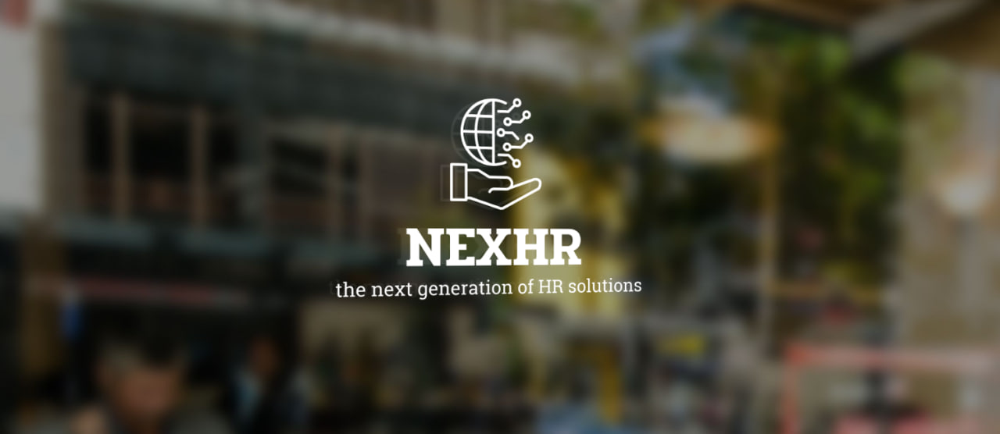
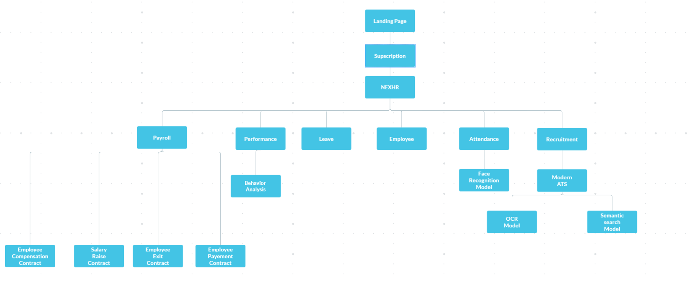
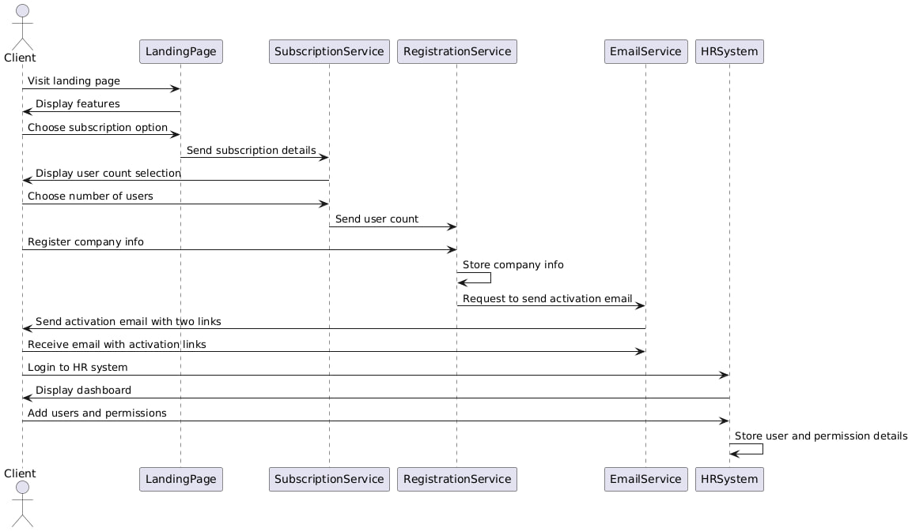
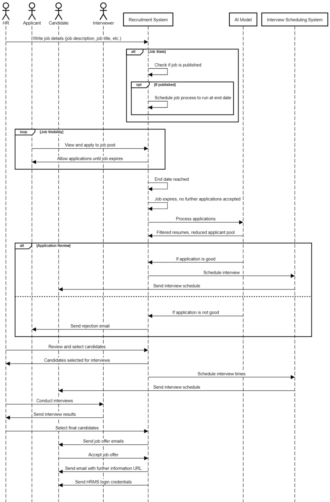
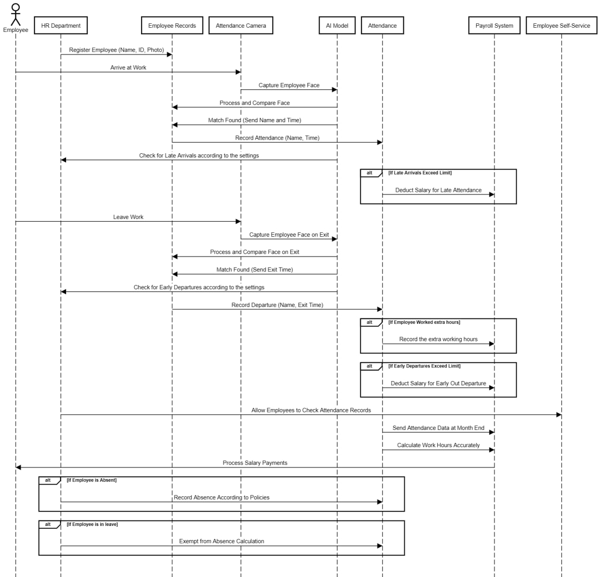
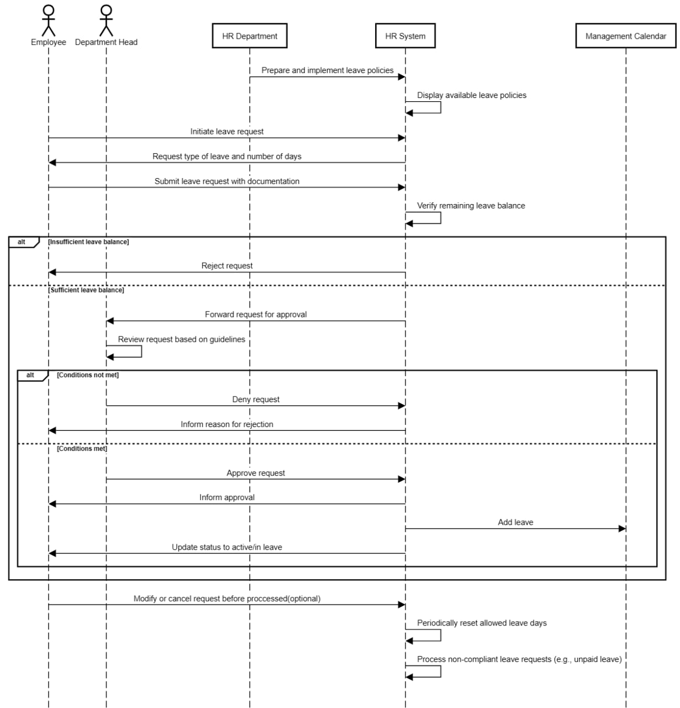
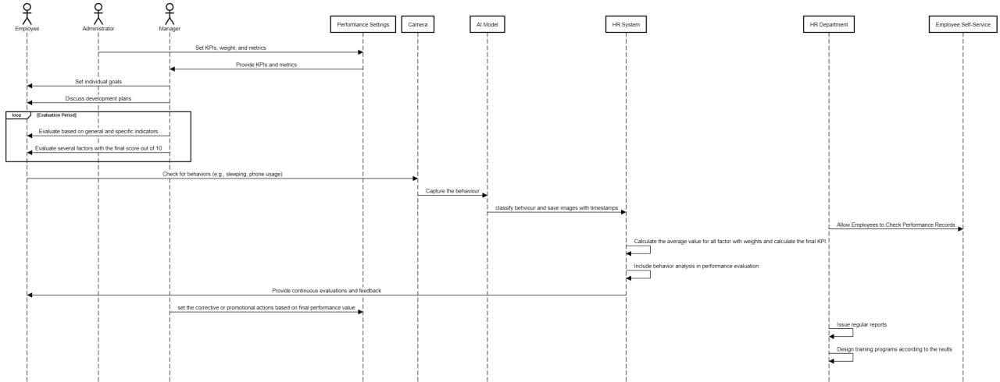
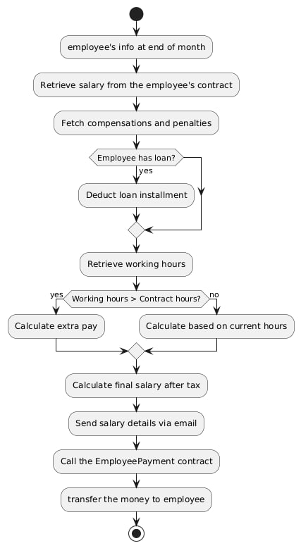
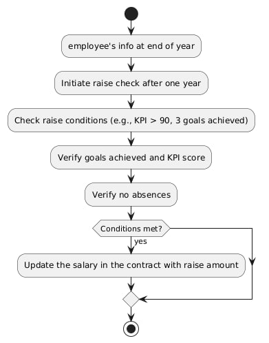

# Next-Gen-HR-A-SaaS-based-HR-management-system-powered-by-AI-and-smart-contracts (Graduation Project)


### Abstract

**NexHR** is a cutting-edge, SaaS-based Human Resource Management System (HRMS) that leverages artificial intelligence (AI) and smart contracts to revolutionize HR operations. This system aims to streamline HR processes, enhance decision-making, and ensure transparency and security in HR transactions. By integrating AI, NexHR offers advanced analytics, predictive insights, and automated workflows. Specifically, it utilizes computer vision for behaviour analysis and attendance automation, semantic search to compare job descriptions with resumes, and optical character recognition (OCR) for efficient document processing. Smart contracts facilitate secure, tamper-proof agreements and transactions. This project demonstrates the potential of combining AI and blockchain technology to create a more efficient, reliable, and future-ready HR management solution.

### Introduction

In today's fast-paced business environment, traditional HR management systems often struggle to keep up with the demands for efficiency, accuracy, and security. **NexHR** addresses these challenges by offering a SaaS-based HR management system powered by AI and smart contracts. This innovative solution is designed to automate routine HR tasks, provide deep insights through data analytics, and ensure the integrity of HR transactions.

**Problems Solved:**

1. **Inefficiency in HR Processes:** Manual HR processes are time-consuming and prone to errors. Next-Gen HR automates these tasks, reducing the time and effort required for HR operations.
2. **Lack of Data-Driven Decision Making:** Traditional systems often lack advanced analytics capabilities. With AI, Next-Gen HR provides predictive insights and data-driven recommendations to support strategic HR decisions.
3. **Security and Transparency Issues:** HR transactions can be vulnerable to tampering and fraud. Smart contracts ensure that all agreements and transactions are secure, transparent, and immutable.
4. **Scalability Challenges:** As organizations grow, their HR needs become more complex. Next-Gen HR is scalable, adapting to the evolving needs of businesses of all sizes.
5. **Manual Attendance and Behaviour Monitoring:** Traditional attendance systems and behaviour analysis methods are often manual and inefficient. Next-Gen HR uses computer vision to automate attendance tracking and analyze employee behaviour, enhancing accuracy and reducing administrative workload.
6. **Job Matching Inefficiencies:** The semantic search capability ensures that candidates are matched based on the context of their skills and experiences, rather than just keywords, leading to better hiring outcomes.


Below is a general diagram providing insights into the components of the NexHR system:




### Acknowledgements

I would like to extend my heartfelt thanks to everyone who contributed to the success of this project. 

Firstly, a big thank you to the HR professionals who provided invaluable insights and information, helping to shape the functionalities and features of the Next-Gen HR system. Your expertise and feedback were crucial in developing a system that truly meets the needs of modern HR management.

I am also deeply grateful to my project supervisor for their guidance, support, and encouragement throughout this journey. Your mentorship has been instrumental in navigating the challenges and achieving the project goals.

Lastly, I want to express my appreciation to all my teachers and mentors who have imparted their knowledge and wisdom. Your teachings have laid the foundation for my skills and understanding, enabling me to undertake and complete this project successfully.

Thank you all for your support and contributions.


Now let's deep dive into the System's components:

### 0- SaaS Subscription

The **SaaS Subscription Model** for NexHR is designed to provide organizations with flexible and cost-effective access to the HR management system. This model offers several key features and benefits:

**Subscription Tiers:** NexHR offers multiple subscription tiers to cater to the varying needs of different organizations.

**Cost-Effectiveness:** By adopting a subscription-based model, organizations can avoid the significant upfront costs associated with traditional software purchases. Instead, they pay a predictable, recurring fee that covers all aspects of the service, including maintenance and support.

**Accessibility:** As a cloud-based solution, NexHR can be accessed from anywhere with an internet connection. This ensures that HR teams and employees can use the system remotely.


Below is a sequence diagram illustrating the flow of the SaaS Subscription System:




### 1- Employees Information System

The **Employees Information System** is a core component of NexHR, designed to manage and streamline various aspects of employee data and departmental operations. It includes the following key features:

**Employee Self-Service:** This feature empowers employees by providing them with direct access to their personal information, payroll details, leave balances, and other HR-related data. Employees can update their information, request leave, and access company policies and documents, reducing the administrative burden on HR staff.

**Employee Data Management:** This module ensures that all employee data is accurately recorded, maintained, and easily accessible. It includes functionalities for onboarding new employees, tracking employment history, managing performance reviews, and maintaining compliance with legal and regulatory requirements. The system's robust data management capabilities help in maintaining a comprehensive and up-to-date employee database.

**Departments Management:** This feature allows HR managers to efficiently organize and manage different departments within the organization. It includes tools for defining departmental structures, assigning roles and responsibilities, and tracking departmental performance. By providing a clear overview of departmental operations, this module helps in optimizing resource allocation and improving overall organizational efficiency.


### 2- Recruitment System

The **Recruitment System** within NexHR is designed to streamline and enhance the hiring process through advanced technologies and automated workflows. This system integrates several key features to ensure efficient and effective recruitment:

**Job Posting and Distribution:** The system allows HR managers to create and job postings within the platform and automate the time for deadline to remove the job posting automaticaly and start the resume screening.

**Resume Parsing and Semantic Search:** Utilizing AI-powered semantic search and OCR for accurate scaning, the system compares job descriptions with resumes to identify the best matches. This approach goes beyond simple keyword matching, understanding the context and relevance of candidates' skills and experiences.

**Interview Scheduling and Coordination:** The system facilitates and automate seamless scheduling of interviews, coordinating between candidates and interviewers. Automated reminders and updates ensure that the process runs smoothly.

**Offer Management:** Once a candidate is selected, the system manages the offer process, including generating offer letters and handling negotiations. 


Below is a sequence diagram illustrating the flow of the Recruitment System:




###  3- Attendance Management System

The **Attendance System** within NexHR leverages advanced computer vision technology to automate and enhance the accuracy of attendance tracking. This system is designed to provide comprehensive insights and streamline attendance management through several key components:

**Dashboard for Insights:** The system features a user-friendly dashboard that provides real-time insights into attendance data. HR managers and supervisors can easily monitor attendance patterns, identify trends, and generate reports. The dashboard offers visual representations of data, such as charts and graphs, to facilitate quick and informed decision-making.

**Attendance Records:** The system maintains detailed attendance records for all employees. These records include timestamps for check-ins and check-outs, ensuring precise tracking of working hours. The automated nature of the system reduces the risk of errors associated with manual entry and provides a reliable source of attendance data.

**Cameras Integrated into the System:** The attendance system utilizes cameras strategically placed within the workplace to capture and analyze employee movements. These cameras are integrated with the computer vision model, which accurately identifies employees and records their attendance. The system ensures privacy and security by adhering to strict data protection protocols.

**Hour Account:** The system includes an hour account feature that calculates the total working hours for each employee. This feature takes into account various factors such as overtime and leave, providing a comprehensive overview of each employee's working hours. The hour account is essential for payroll processing and ensures that employees are compensated accurately for their time.


Below is a sequence diagram illustrating the flow of the  Attendance Management System:




### 4- Leave Management System

The **Leave Management System** within NexHR is designed to streamline the process of managing employee leave requests and approvals. This system ensures efficiency, transparency, and accuracy in handling various types of leave. Key features of the Leave Management System include:

**Leave Request Submission:** Employees can easily submit leave requests through the Eployee self-service system. The user-friendly interface allows employees to specify the type of leave (e.g., vacation, sick leave, personal leave), the duration, and any additional details required.

**Approval Workflow:** The system automates the approval workflow, routing leave requests to the appropriate supervisors or HR personnel for review. Emails are sent to both the approver and the employee, ensuring timely processing of leave requests.

**Leave Balance Tracking:** The system maintains accurate records of each employee's leave balances. Employees can view their available leave balances, helping them plan their time off more effectively. HR managers can also monitor leave balances to ensure compliance with company policies.

**Integration with Attendance, Performance and Payroll:** The Leave Management System is integrated with the attendance and payroll systems. Approved leave is automatically reflected in attendance records, and the system adjusts payroll calculations accordingly, and also integrated with the Performance system to give accurate KPI value.

**Policy Compliance:** The system ensures that all leave requests and approvals comply with company policies and legal requirements. It automatically enforces rules related to leave accrual, carryover, and maximum allowable leave, reducing the risk of non-compliance.


Below is a sequence diagram illustrating the flow of the  Leave Management System:




### 5- Performance Management System

The **Performance Management System** within NexHR is designed to comprehensively evaluate and enhance employee performance through a structured and data-driven approach. This system integrates several key components to ensure a fair, transparent, and effective performance management process:

**Setting Performance Metrics:** Establish clear and measurable performance metrics that align with organizational goals. These metrics serve as the foundation for evaluating employee performance and ensuring consistency in assessments.

**Goal Setting and Development Plans:** Collaborate with employees to set individual performance goals and create personalized development plans. These plans are designed to support continuous professional growth and align employee objectives with organizational priorities.

**Evaluation Period:** Define specific evaluation periods to regularly assess employee performance. This periodic evaluation helps in maintaining a consistent and ongoing review process, ensuring timely feedback and adjustments.

**Behavior Monitoring:**
   - **Camera Monitoring:** Employee behaviors, such as sleeping or phone usage, are monitored by strategically placed cameras within the workplace.
   - **Data Capture:** The cameras capture these behaviors and send the data to the AI model for analysis, ensuring objective and accurate monitoring.

**Performance Records Access:** Provide both employees and managers with access to comprehensive performance records. This transparency facilitates informed decision-making and fosters a culture of accountability and continuous improvement.

**KPI Calculation:** Utilize the AI model to calculate Key Performance Indicators (KPIs) based on the captured data and predefined performance metrics. This ensures an objective, data-driven approach to evaluating employee performance.

**Continuous Feedback:** Implement a system for continuous feedback, allowing employees to receive regular updates on their performance. This ongoing feedback loop encourages open communication and supports continuous improvement.

**Corrective and Promotional Actions:** Automatically trigger corrective such as set training programs or promotional actions based on the final KPI calculations. This ensures that employees are recognized for their achievements and provided with opportunities for growth or improvement as needed.


Below is a sequence diagram illustrating the flow of the  Performance Management System:




### 6- Payroll System Using Smart Contracts

The **Payroll System** within NexHR leverages smart contracts to automate and secure payroll processing, ensuring accuracy, transparency, and efficiency.
Smart contracts in the Payroll System automate salary calculations and disbursements, ensuring accuracy and reducing errors. They provide real-time processing, enhancing efficiency and employee satisfaction. The transparency and security of blockchain technology build trust and ensure compliance with legal regulations. Additionally, smart contracts offer cost savings by minimizing administrative overhead and preventing payroll-related discrepancies.


#### Monthly Payroll Processing Contract

The system automates the monthly payroll process, ensuring timely and accurate salary payments to employees. Smart contracts handle the calculations and transactions, reducing the risk of errors and ensuring compliance with company policies and regulations.

#### Employee Exit Contract

**Initiation:** The employee initiates the exit process through the Employee Exit Smart Contract.
**Condition Fetching:** The contract retrieves the employee's conditions, such as annual compensation.
**Data Retrieval:** It gathers current working hours from the Attendance System and unused leave details from the Leave Management System.
**Final Calculation:** The contract calculates the final payout value based on the retrieved data.
**Payment Transfer:** The company fetches the company's wallet, and the Employee Exit Smart Contract transfers the final amount to the employee's wallet.

#### Salary Raise Contract

**Initiation:** After one year, the employee initiates a raise check through the Conditional Salary Raise Smart Contract.
**Condition Verification:** The contract checks raise conditions, such as a KPI score greater than 90 and the achievement of three goals.
**Data Verification:** It verifies the goals achieved and KPI score from the Performance Management System and checks for no absences from the Attendance System.
**Salary Update:** If conditions are met, the contract updates the employee's salary with the raise amount.

#### Compensation Contract

**Initiation:** The employee initiates the compensation process based on specific conditions through the Employee Compensation Smart Contract.
**Performance Data Fetching:** The contract retrieves performance details from the Performance Management System.
**Condition Verification:** If the conditions are met, the company fetches the company's wallet.
**Compensation Transfer:** The Employee Compensation Smart Contract transfers the compensation amount to the employee's wallet.

It looks like there might be a typo in the image file name for the Monthly Payroll Processing Contract Diagram. The file name should be "Payroll.jpg" instead of "Pyaroll.jpg". Here’s the corrected version:

```markdown
Below are activity diagrams for two of the contracts:

**Monthly Payroll Processing Contract Diagram:**


**Salary Raise Contract Diagram:**

```


### Possible Improvements

While the NexHR system offers a comprehensive and advanced solution for HR management, there are always opportunities for further enhancement. Future improvements could include:

**Enhanced AI Capabilities:** Continuously improving the AI models for even more accuracy.
**Integration with External Systems:** Expanding integration capabilities with other enterprise systems such as ERP and CRM for a more unified business process.
**Mobile Application Development:** Developing a mobile app to provide employees and HR managers with on-the-go access to the system.
**Advanced Analytics and Reporting:** Introducing more sophisticated analytics tools and customizable reporting features to provide deeper insights into HR metrics.


